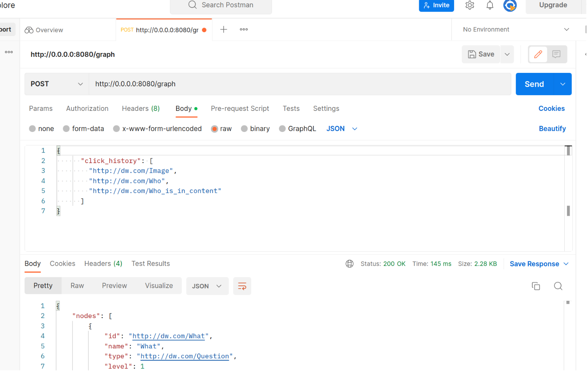

# KID Knowledge Web Backend

It is a repository that contains the source code for implementing the backend of the website. 
Given user click history, the code retrieves a subgraph of the knowledge graph, and then returns a dictionary containing nodes and edges of the subgraph.

## Background
The users create markdown files based on the templates and set of rules to add questions, tasks, tools about verification. We create the knowledge graph based on ttl from the markdown files. 
More information about the process can be found at the source [code](https://github.com/dw-innovation/KID-knowledge) for transferring the markdown files to a knowledge graph.

## Installation
There are two options for installing the backend code.
1. Create a virtual environment with Python 3.8
   1. After that, install the necessary libraries `pip install -r requirements.txt`
   2. Run the shell command to activate the server code: 
   
      ``` shell sh exec uvicorn app.main:app --reload --port 8080 --host 0.0.0.0``` 
2. Run the Dockerfile inside the code.
   ``` docker run -p 8080:8080 -it $(docker build -q .)``` 

## API Requests
After installation, the backend API is ready for sending a request.

The API endpoint is http://0.0.0.0:8080/graph . You can send a request through tools such as Postman.

The input of the request should be a dictionary containing a click history of a user:

```json
{
      "click_history": [
        "http://dw.com/Image",
        "http://dw.com/Who",
        "http://dw.com/Who_is_in_content"
      ]
}
```


The output is a dictionary of nodes and edges of the subgraph:

```json
{
    "nodes": [
        {
            "id": "...",
            "name": "...",
            "type": "...",
            "level": 1
        },
        {
            "id": "...",
            "name": "...",
            "type": "...",
            "level": 1
        },
        {
            "id": "...",
            "name": "...",
            "type": "...",
            "level": 2
        }
    ],
    "links": [
        {
            "source": "...",
            "target": "..."
        },
        {
            "source": "...",
            "target": "..."
        },
        {
            "source": "...",
            "target": "..."
        }
    ]
}
```


The real example of a request through Postman:


More details about the API functions can be accessed at http://0.0.0.0:8080/docs .


Feel free to open an issue if you find a bug or give a suggestion or ask a new feature.
